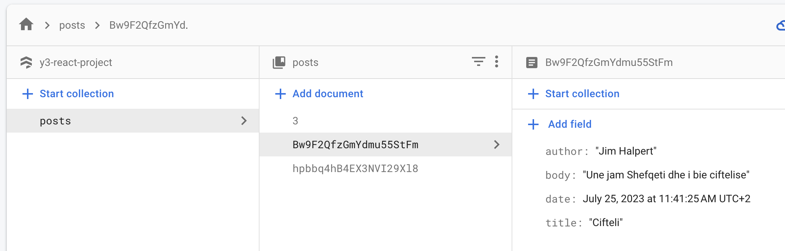

# Y3 - REACT NATIVE BLOG

## Prerequisites

1. Add your firebase credentials to `utils/Firebase.js`
2. Create a new firebase collection called `posts` with the following data split up into multiple documents

